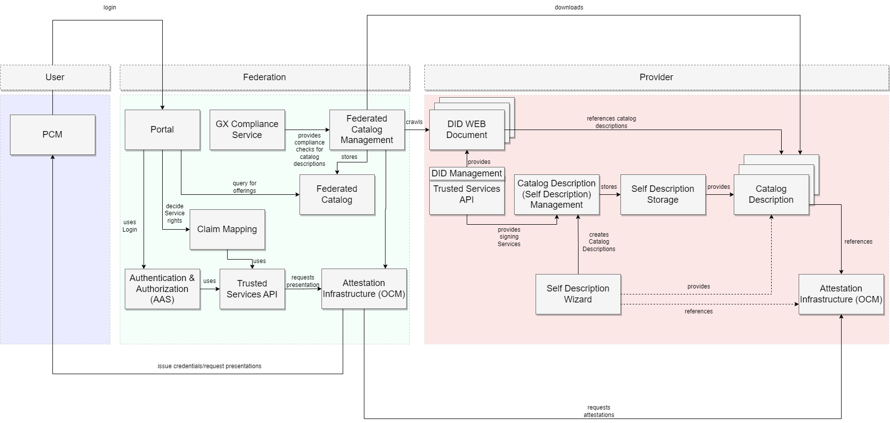
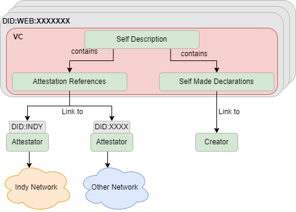
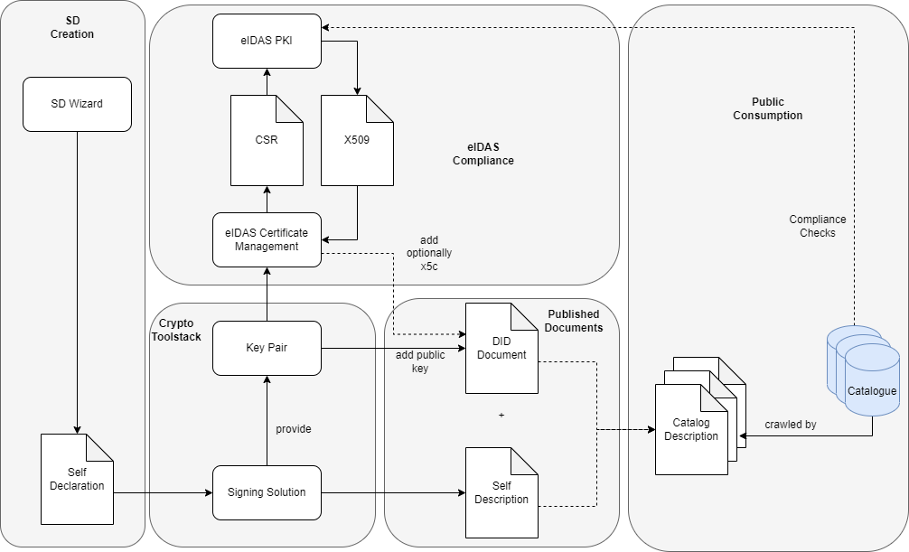

# Integration Guidelines

## Introduction

The integration goal of this project is to provide an up and running cluster of a federation out of the box. This shall be realized by helm charts and argo-cd projects. Details about the setup can be found [here](SETUP.md).


## Federation Architecture

### Overview 

This picture illustrates the architecture of the federation and the basic components for it. For the moment the setup is dual use for provider and federator, but it can be split by seperated argo cd environments. 

<p align="center">
  
</p>


### Self Description/Metadata Umbrella

The self description has the purpose to declare metadata about an entity as public resolvable information. This could be a service offering, a datacenter or something else. When the purpose of the self description is to add it in the catalog, it's automatically an catalog description, because a self description SHOULD be made especially for one catalog. The declaration can be made by doing self made declarations or replacing them by attestation references which can be secured by any kind of ledger network or other technologies. If a attestation reference is provided, the infrastructure MUST be available that the reference can be requested at any time. Means if an ISO certificate is issued, and the attestation is referenced in the description, the holder of the certificate MUST be able to proof it when it's requested by the verifier. All self descriptions are signed by the declaring party to ensure that the statements are not tampered, and optionally that the declaration is eIDAS compliant during the creation or the time of usage (for this purpose eIDAS signatures have to be used for the catalog description).   

<p align="center">
  
</p>


The DID:WEB is mandatory for creating self descriptions to establish the metadata universe within the dataspace. For the DID:WEB MUST be the following things considered: 

- the key pair should be created automatically by any kind of vault
- for signatures of the descriptions the key pair should be used to request eIDAS compliant certificates (not yet implemented, can be made by creating CSRs automatically)
- the DID should be created automatically and never be reused by any other asset, in the best case one DID per asset an catalog (in this example we just create it manually by using did management)


### Provider Requirements
Core Requirement for the Provider is, to create the DID:WEB Documents for providing the catalog description references. This means each provider MAY provide per Federation an catalog description, but the MUST provide at least one catalog description for his offering. Important here is, that each and every asset gets an DID:WEB. Therefore the [DID Management](https://gitlab.com/gaia-x/data-infrastructure-federation-services/por/did-management-service) was created to provide an easy way of creating DIDs over the TSA to provide it to the public. An example can be found [here](https://integration.gxfs.dev/api/dynamic/did/legalInformation). Each DID Document contains key pairs which are created explicitly for each DID by using hashicorp vault in the background. Each created Self Description must be linked to relevant DID:WEB to be signed correctly by TSA. In this example the DID:WEB were created over the DID Management and linked manually to the Self Description (because SD Wizard supports the linkage currently not yet). 

The provider MUST also append all relevant attestation references into the catalog descriptions so far required.


By resolving this DID, the catalog description can be picked up by using the service endpoint in the did document, which references to the [self description storage](https://integration.gxfs.dev/api/self-descriptions/description?did=did%3Aweb%3Aintegration.gxfs.dev%3Aapi%3Adynamic%3Adid%3AlegalInformation). An example implementation of the storage can be found [here](https://gitlab.com/gaia-x/lab/gaia-x-example-self-description-storage) and [here](https://gitlab.com/gaia-x/data-infrastructure-federation-services/por/self-description-management). The federator is then able to pickup all catalog descriptions during the onboarding without any further action. For the moment the assumption is, that the catalog descriptions and the containing informations are downloaded during the onboarding in the federator without the need of additional authentication against the provider (which can be relevant for some kinds of federations). 

### Federator Requirements

The federation MUST provide an onboarding process for an business owner by issuing an credential in business owners PCM. If this is done, the business owner is able to onboard a DID:WEB for this service which is crawled then by the federated catalog management. All downloaded information will be checked for compliance and be added later in the catalog for indexing the information for search. This download will be made cylic to quarantee the avaibality of the data. If someone requests the proof for the contained attestations, the attestation infrastructure can request it on demand or automatically.

## Catalog Description


### Creation

At first the Self Declaration is made by using a tool e.g. the Self Declaration Wizard. If the declaration was made, a signing tool e.g. the TSA signing service can be used to use a the private key of a key pair to sign the SD by wrapping it into a VC which is published as Self Description on a public endpoint, linked to a DID. The DID needs to be generated beforehand together with the key pair or optionally with a X509 certificate in the JWK of the verification methods. After resolving the did document and the self description, the signature can be checked as for compliance and validity. 

<p align="center">
  
</p>


### Attestation References
TBD

### Attestation Infrastructure and Proofs

TBD

### Self Description Linkage Credential

TBD

### Self Description Linkage Presentation

The self description linkage presentation is a VP container which is generated by the SD storage to "pack" a set of sd linkage credentials for a compliance approval. The compliance checkup is then able to rely on just one set of data instead of resolving all one by one. This allows a "versioning" of the statements according to compliance version X. The result of this checkup should be a compliance credential issued directly into the wallet of the holder. 

## How to Setup a Self Description and provide it to a Catalog

The self description MUST be created semantically correct over an tool or manual (e.g. the self description wizard). In the best case a self description contains only attestation references, but depending on the use case, the claims can be self declared as well. After creating the SD it MUST ensured that: 

1) the SD is packaged into a VC
2) signed by an unique key pair refering to an DID (in the best case the key pair is certified by an eIDAS compliant PKI)
3) the signed VC is published over an resolvable URL
4) the URL is referenced in the DID:WEB under gx-catalog-description


Example Output:

```
{
  "@context": [
    "https://www.w3.org/2018/credentials/v1",
    "http://schema.org"
  ],
  "credentialSubject": {
    "description": {
      "@context": {
        "schema": "http://schema.org/"
      },
      "@id": "did:web:registry.gaia-x.eu:Provider:MuHsI8a92lQ05y4qeUZlWzDRgaej4Irvd4s2",
      "@type": "trusted-cloud:legalInformation",
      "attestationReference": {
        "name": "Legal Information",
        "presentationDefinition": {
          "input_descriptors": [
            {
              "constraints": {
                "fields": [
                  {
                    "filter": {
                      "const": "AR7nFzwhjpm5AamWKLu4JA:2:gxfs-legal-information-v:1.0.0",
                      "type": "string"
                    },
                    "path": [
                      "$.schemaId"
                    ]
                  },
                  {
                    "path": [
                      "$.did",
                      "$.credentialSubject",
                      "$.legalName",
                      "$.legalForm",
                      "$.registrationNumber",
                      "$.headquarterAdress",
                      "$.vatNumber",
                      "$.registrationDate",
                      "$.SME",
                      "$.managingDirector",
                      "$.mainContact",
                      "$.dataProtectionOfficer",
                      "$.description"
                    ]
                  }
                ]
              },
              "id": "legalInformation_Credential",
              "name": "Notarized Legal Information Credential",
              "purpose": "Proofs a valid entity."
            }
          ]
        },
        "protocol": "AIP",
        "version": "1.0"
      }
    },
    "id": "did:web:integration.gxfs.dev:api:dynamic:did:legalInformation"
  },
  "id": "urn:test:fe23d8c0-e537-44f7-8202-4c3191506792",
  "issuanceDate": "2023-02-28T11:09:41.964Z",
  "issuer": "did:web:integration.gxfs.dev:api:dynamic:did:legalInformation",
  "proof": {
    "created": "2023-02-28T11:09:42.723371553Z",
    "jws": "eyJhbGciOiJKc29uV2ViU2lnbmF0dXJlMjAyMCIsImI2NCI6ZmFsc2UsImNyaXQiOlsiYjY0Il19..MEQCIAi9jdGMFUUIAodohuTGCTj2t3IHJ9ne21fLoj2kINIaAiAcONVbu87NzEiWexNEwFhZCUrptDAj8q8jABrg0gmuqw",
    "proofPurpose": "assertionMethod",
    "type": "JsonWebSignature2020",
    "verificationMethod": "did:web:integration.gxfs.dev:api:dynamic:did:legalInformation#key-1"
  },
  "type": [
    "VerifiableCredential",
    "LegalInformationCatalogDescriptionCredential"
  ]
}


```

Important here is, that each and every DID:WEB used in the SD, has the same endpoint references and unique key pairs present. 

After this, the DID:WEB of the service can be used for onboarding in each catalog, which is able to resolve then the descriptions from the endpoints. The result looks then like this as followed: 

```

{
  "@context": [
    "https://www.w3.org/ns/did/v1",
    "https://w3id.org/security/suites/jws-2020/v1"
  ],
  "id": "did:web:integration.gxfs.dev:api:dynamic:did:legalInformation",
  "service": [
    {
      "id": "did:web:integration.gxfs.dev:api:dynamic:did:legalInformation#catalog-desc",
      "serviceEndpoint": "https://integration.gxfs.dev/api/self-descriptions/description?did=did%3Aweb%3Aintegration.gxfs.dev%3Aapi%3Adynamic%3Adid%3AlegalInformation",
      "type": "gx-catalog-description"
    }
  ],
  "verificationMethod": [
    {
      "controller": "did:web:integration.gxfs.dev:api:dynamic:did:legalInformation",
      "id": "did:web:integration.gxfs.dev:api:dynamic:did:legalInformation#key-1",
      "publicKeyJwk": {
        "crv": "P-256",
        "kid": "key-1",
        "kty": "EC",
        "x": "sx0KUg440me1h2qVoSDiUMVeOcTlKFWOxedphWsMHqY",
        "y": "gN9iKDMiavEu-cNCIEJhTDIWFgEwwWyoXaeAX-yc71E"
      },
      "type": "JsonWebKey2020"
    }
  ]
}

```


## How to Setup a Federation

### Overview

This chapter descripes how to setup a federation and which points should be considered before starting. The first important point is to decide which type of federation should be created. For the moment there are three types identified: 

- Guild Federation
- Business Federation
- Community Federation

Depending on the type of the federation the requirements may changed for the providers, users and federators. 

#### Guild Federation

A guild federation is a federation which consists of "freelancer" members or very small companies which are not able to host/deploy own infrastructure. This could be the case for farmers, craftmen or similiar. The federator provides in this case all necessary infrastructure for onboarding, signing, hosting etc. Mostly the members are directly known by the chambers, so the onboarding and compliances processes can be simplified or they are already established.  


#### Business Federation


A business federation is an federation which consists of companies which decided to federate. Each of the companies has it's own infrastructure and want to join the federation. In this case, each of the member must be identified and attested before it can be a part of the federation. The federator has here a lot of compliance and orchestration tasks. Each member of the federation must provide a basic set of components an infrastructure. The integration example in this repo is such a example. 


#### Community Federation

A community federation is a federation which is completly open for participants. Just the compliance processes decide who can be a member or not. The community federation provides just compliance processes and a basic set of toolstack to ensure the interoperability. 

### Common User Requirements

Each user should have an wallet where he can store it's private keys and which supports the used protocols by the federators. 

### Common Provider Requirements
TBD

### Common Federator Requirements

TBD
### Guild Federator
TBD

### Business Federator
TBD

### Community Federator


