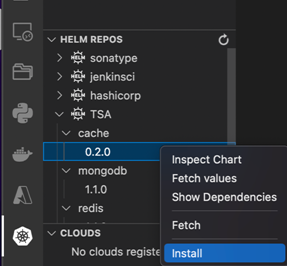
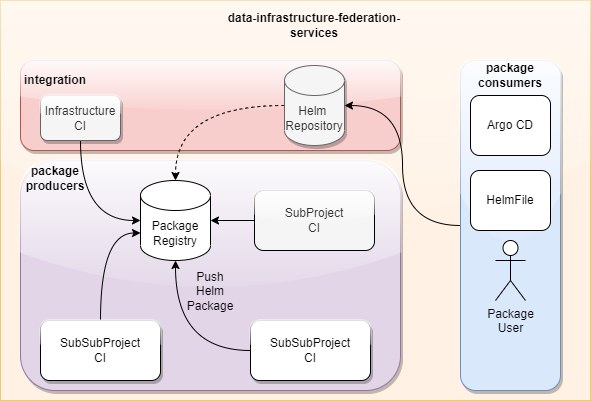

# Cluster Setup

## Pre-Requisites

1) Kubernetes 1.25+
2) ArgoCD Installation
3) Each software component must publish over the CI an helm package
4) All sensitive values should be set by environment variables. Environment variables should use secretRefs which map to Kubernetes Secrets.

## Integration Repository Structure

This repository provides a public folder which is pushed over the CI to gitlab pages. The folder contains helm repository index files for each sub component. The goal of this is to provide in developer IDEs the charts directly for installation over [helm repositories](https://helm.sh/docs/topics/chart_repository/): 



This allows it to cherry pick all components as wished easily. But the packages dont realize NO a out of the box installation for infrastructure, because there are too much side conditions depending on the cluster. E.g. for 

- used managed/unmanaged databases
- setup of message bus
- controlling of ingress rules

Therefore the repository contains helm charts for infrastructure and ingress seperatly and all other helm charts MUST NOT provide that by default. But the sub projects can create helmchart packages and repositories by their own which are not referenced in the integration index.

## Helm Package Handling



## Package Versioning

All packages must be names like {groupname}.{projectname}.{version}-integration.tar.gz


## Folder Structure

All folders for helm charts must be structured for environment under helm/charts/{environment}. E.g. helm/charts/integration or helm/charts/dev


## Helm Charts

## Common 


### Infrastructure

Don't integrate in the integration helmcharts infrastructure or ingresses. This will be managed in integration repo. Please refer in your helmcharts just to the respective service arcording to the following table:

### Namespaces

In all helmcharts, the namespace must be included as per project name. E.g. "Trusted Services" or "Portal". Don't use the subproject name as namespace. The namespace should be structured like this:

- Postgres
- Redis
- MongoDb
- Portal
- Catalog
- TSA
- OCM
- ...

### Database Integration

The database integration works over helm hooks which refer to the superuser and the settings for creating the db account and db users.

### Secrets

All secrets will be handled by the [external secret operator] ( https://external-secrets.io), which means that each helmchart must use for each secret secretRefs instead of embedding the secrets in the manifest files. 

Note: All random secrets should set to ignoreDifferences in Argo CD: 
```
 ignoreDifferences:
    - group: ""
      kind: "Secret"
      jsonPointers:
      - /data
    syncPolicy:
      syncOptions:
      - RespectIgnoreDifferences=true
``` 

### OCM Initialization

#### SSI Abstraction

The SSI Abstraction relies either on ID Union or an SOV network. This can be configured in the ledgerID in the values file. (e.g. ledgerId: ID_UNION)

For ID Union the API Key for the endorser registration must be configured in the secret ssi-abstraction-{name}-idunion-secret. 

#### Principal Manager

1. Create a schema by POST to AttestationManager {{baseUrl}}/v1/schemas
2. Create credential definition over AttestationManager {{baseUrl}}/v1/credentialDef
3. (Optional) Set Principal Manager Credential Type by using: 

```
POST /v1/credentialType
{
    "type": "principalMemberCredential",
    "schemaId": "7KuDTpQh3GJ7Gp6kErpWvM:2:test_profileCredential-220722:1.0"
}
OR
PATCH /v1/updateSchemaIdByType?type={credentialType}
{
    "schemaId": "7KuDTpQh3GJ7Gp6kErpWvM:2:test_principalMemberCredential-060722:1.0"
}
``` 

### Pod Settings

All pods must be in the helm templates aware of the configuration/usage of istio by using [istio annotations] (https://istio.io/latest/docs/setup/additional-setup/sidecar-injection/#controlling-the-injection-policy). The settings must be optional and must follow the pattern: 
```
istio:
  injections:
    pod: true
    namespace: true
```

The default in the values.yaml schould be:
```
istio: {}
```

## Argo CD Installation

To install argoCD from scratch, the following steps must be considered:

1) Execute: `make bootstrap`
2) For public access a tls cert is required. Add for example the argocd-wildcard secret for tls and put the tls secrets in it. You can also copy it from another namespace:  

```
kubectl get secret argocd-wildcard --namespace=operators -o yaml | sed 's/namespace: .*/namespace: argocd/' | kubectl apply -f -
```

3) Add the keycloak clientSecret to the argocd-secret. Add a new key: oidc.keycloak.clientSecret and the corresponding base64 encoded value.

4) Apply the app-of-app argocd Application
```
make app-of-apps ENV=integration
```

If you make any changes to environments/<env>/values.yaml you need to re-run the above command.


---

If you want to delete the namespaces it can happen that the namespaces are stucking. In this case you can do the following: 

```
(
NAMESPACE=<your-namespace>
kubectl proxy &
kubectl get namespace $NAMESPACE -o json |jq '.spec = {"finalizers":[]}' >temp.json
curl -k -H "Content-Type: application/json" -X PUT --data-binary @temp.json 127.0.0.1:8001/api/v1/namespaces/$NAMESPACE/finalize
)

```

